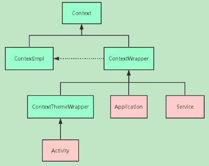

# Context

Interface to global information about an application environment. This is an abstract class whose implementation is provided by the Android system. It allows access to application-specific resources and classes, as well as up-calls for application-level operations such as launching activities, broadcasting and receiving intents, etc.

**Context** is abstract class, all of the methods are abstarct (only `getSystemService(Class)` has an implementation and that invokes an abstract method). Implementation for abstract methods provided by the implementing classes, which include:

- ContextWrapper
- Application
- Activity 
- Service
- IntentService

## Get Context methods

There are 3 most used function for getting Context: 
- `getContext()` — returns the Context which is linked to the Activity from which is called.
- `getApplicationContext()` - returns the Context which is linked to Application
- `getBaseContext()` - returns which ever context is being wrapped by ContextWrapper.

## What Context can do?

Context is powerful, but it still has some restrictions. Since context is implemented by ContextImpl, so in most situations we can use activity, service and application context in common. However, in some situation like start a Activity or pop up a dialog, it must use Activity context since a new Activity is based on another Activity to form a stack, also a popup dialog need to show on top of Activity except some system alert dialog.

1. An application CAN start an Activity from here, but it requires that a new task be created. This may fit specific use cases, but can create non-standard back stack behaviors in your application and is generally not recommended or considered good practice.
2. This is legal, but inflation will be done with the default theme for the system on which you are running, not what’s defined in your application.
3. Allowed if the receiver is null, which is used for obtaining the current value of a sticky broadcast, on Android 4.2 and above.

## Links
https://developer.android.com/reference/android/content/Context      
https://www.freecodecamp.org/news/mastering-android-context-7055c8478a22/      
https://medium.com/@ali.muzaffar/which-context-should-i-use-in-android-e3133d00772c     
https://ericyang505.github.io/android/Context.html  
https://medium.com/@banmarkovic/what-is-context-in-android-and-which-one-should-you-use-e1a8c6529652  
https://stackoverflow.com/questions/4128589/difference-between-activity-context-and-application-context
