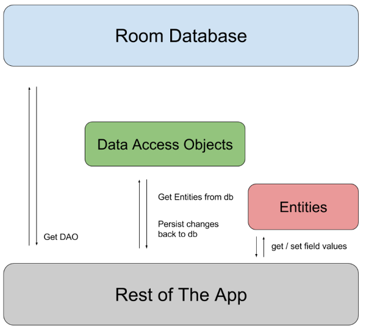

# Room

The Room persistence library provides an abstraction layer over SQLite to allow for more robust database access while harnessing the full power of SQLite.

The library helps you create a cache of your app's data on a device that's running your app. This cache, which serves as your app's single source of truth, allows users to view a consistent copy of key information within your app, regardless of whether users have an internet connection.

To use Room in your app, add the following dependencies to your app's build.gradle file:

```
dependencies {
  def room_version = "2.2.5"

  implementation "androidx.room:room-runtime:$room_version"
  annotationProcessor "androidx.room:room-compiler:$room_version" // For Kotlin use kapt instead of annotationProcessor

  // optional - Kotlin Extensions and Coroutines support for Room
  implementation "androidx.room:room-ktx:$room_version"

  // optional - RxJava support for Room
  implementation "androidx.room:room-rxjava2:$room_version"

  // optional - Guava support for Room, including Optional and ListenableFuture
  implementation "androidx.room:room-guava:$room_version"

  // Test helpers
  testImplementation "androidx.room:room-testing:$room_version"
}
```

## Components of Room DB


The three major components of Room are:
- **Database**: It represents the DB, it is an object that holds a connection to the SQLite DB and all the operations are executed through it. It is annotated with `@Database`.
- **Entity**: Represents a table within the Room Database. It should be annotated with `@Entity`.
- **DAO**: An interface that contains the methods to access the Database. It is annotated with `@Dao`.

## Configuring Compiler Options

Room has the following annotation processor options:

- `room.schemaLocation`: Configures and enables exporting database schemas into JSON files in the given directory.
- `room.incremental`: Enables Gradle incremental annotation proccesor.
- `room.expandProjection`: Configures Room to rewrite queries such that their top star projection is expanded to only contain the columns defined in the DAO method return type.

## Links  
https://developer.android.com/topic/libraries/architecture/room  
https://developer.android.com/jetpack/androidx/releases/room  
https://medium.com/mindorks/using-room-database-android-jetpack-675a89a0e942  
https://medium.com/mindorks/room-kotlin-android-architecture-components-71cad5a1bb35  
https://medium.com/androiddevelopers/7-steps-to-room-27a5fe5f99b2  
https://www.youtube.com/watch?v=SKWh4ckvFPM
