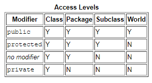

# Access modifiers

The access modifiers in Java specifies the accessibility or scope of a field, method, constructor, or class. We can change the access level of fields, constructors, methods, and class by applying the access modifier on it. There are four types of access modifiers available in java:

1. **Default**. The data members, class or methods which are not declared using any access modifiers i.e. having default access modifier are accessible only within the same package.
2. **Private**. The access level of a private modifier is only within the class. It cannot be accessed from outside the class.
3. **Protected**. The methods or data members declared as protected are accessible within same package or sub classes in different package.
4. **Public**. The access level of a public modifier is everywhere. It can be accessed from within the class, outside the class, within the package and outside the package.

The following table shows the access to members permitted by each modifier:

## Links
https://docs.oracle.com/javase/tutorial/java/javaOO/accesscontrol.html  
https://www.javatpoint.com/access-modifiers  
https://www.geeksforgeeks.org/access-modifiers-java/  
